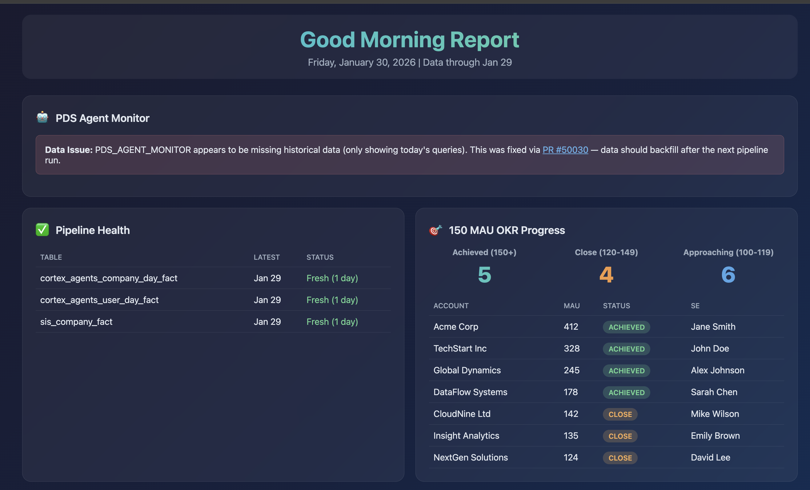

# Good Morning

Automating the mundane, all with Cortex Code. I started using this skill because as a data scientist at Snowflake working on Snowflake Intelligence and Streamlit in Snowflake, my mornings were all very similar. Every morning, I would wake up and check metrics from 3 dashboards, get an update on the data pipelines I own (and fix them if they fail), check my calendar for analyses to do, and if any of these break, I go and figure out the fix and submit a PR. Could I automate this?

In the past, the best I could do was a series of alerts that were just yet another thing to test. Instead, I wrote goodmorning.md, which is just a markdown file describing what you care about, what SQL you already have validated and run every day, and what you want your agent to do with said results. 

So now, every morning I just tell Cortex Code good morning, and it spits out a lovely html file. Here is the first bit of a synthetic version of what I see every morning.

Try out making your own by creating a profile / manifesto / template, and let us know how it goes!

**Credits**: [Tyler Richards](https://tylerjrichards.com/), [Zachary Blackwood](https://www.linkedin.com/in/blackary/), [Mark Huberty](https://www.linkedin.com/in/mark-huberty-99665157/), [Tyler Simons](https://www.tylersimons.com/)
